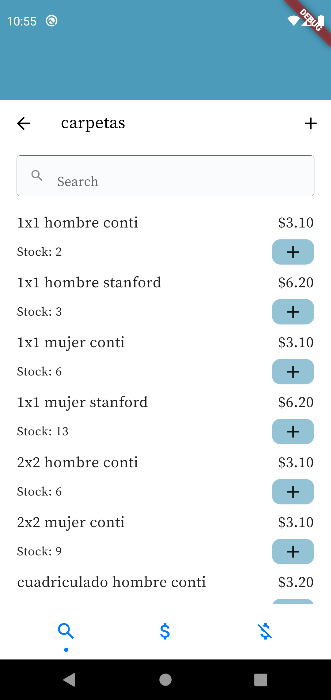
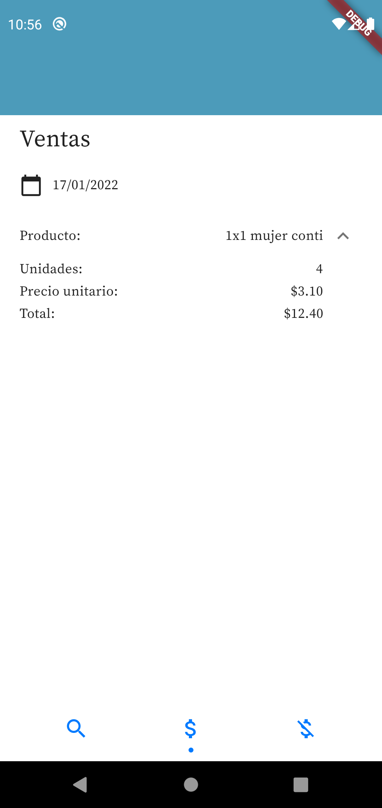

# Inventory management app

The app was made to manage the inventory of a small business/medium business, it organize the data (products) in categories, and allow to add sales and purchases for an easy control.

## Features

- Create, edit, delete categories, products, purchases and sales.
- Search bar for categories and products.
- Date picker to request the purchases and sales of different days.

## Screenshots

Categories                 |  Solarized Ocean            |    Sales
          :---:            |         :---:               |    :---:
   |    |   

## Dependencies

- State management: [riverpod](https://pub.dev/packages/flutter_riverpod)
- Database: [cloud_firestore](https://pub.dev/packages/cloud_firestore)

## Installation

 1. [Setup Flutter.](https://docs.flutter.dev/get-started/install)
 2. Clone the repository.
 3. [Setup firebase](https://firebase.flutter.dev/docs/overview)
*I recommend install Firebase CLI via npm. 

    